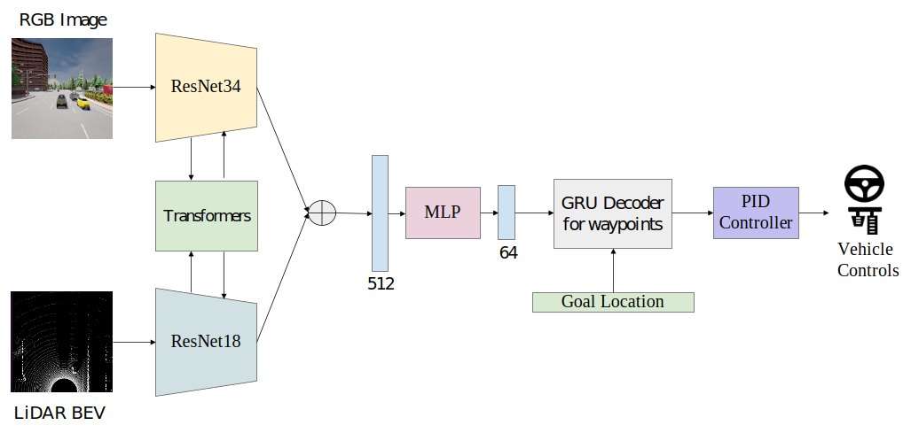

# Transfuser in Imitation Learning based on Carla

```
The Logic of Transfuser:

```


 


## Research Content:  
[Transfuser Paper](https://arxiv.org/pdf/2104.09224.pdf)    
[Model-based RL Paper](https://arxiv.org/abs/2105.00636)    
[Model-free RL Paper](https://arxiv.org/abs/1911.10868)   

## Contribution  
Edited by kuancalvin2016@gmail.com  
Original Code from Transfuser Official Github  

## Setup
PS. Please make sure you install all of the things by the right order.  

```
1. Nvidia GPU(GeForce GTX 1080 Mobile)  
2. Ubuntu 18.04   
3. Nvidia GPU Driver(470.63.01)  
4. CUDA(10.1)  
5. CuDNN(8.0.4)
6. Python 3.7 (Do not install from Anaconda) 
7. pyGame
8. Carla 0.9.10.1   
9. Dowload the additional maps from Carla  
10. vulkan-utils  
11. torch(1.4.0)  
```

**Trouble Shooting:**  
1. Import carla not found
- Ensure you have py3.7 egg file in the dir : /opt/carla-simulator/PythonAPI/carla/dist   
2. 4.26.2-0+++UE4+Release-4.26 522 0 Disabling core dumps. Exiting abnormally (error code: 1)  
- Install the latest or recommended nvidia driver  
- Downloaded the supported map package from official website.  
- sudo apt install vulkan-utils  
3. The FPS of simulation is low so that the simulation occurs lagging problem.
- Adjust the FPS parameters from Transfuser agent and environment
5. The lag of simulation when predicting
- There is a sync mode to ensure the time aligned between agent/environment and simulator. This will lead to the simulator become lagging since it needs to sync with environment. Hence, We can store the simulation into Carla log file and replay it after that.   
6. The agent will stop after collision or specific scenario.  
- This issue is from Transfuser autopilot agent. This leads to the transfuer NN will stop when it collides the pedestrian or cars and stop when it crosses the intersection. PS. This is the main drawback from the paper of Transfuser. [Solved] Removed the scenrio will prevent the agent from this stop issue.  


**Metrics:** 

| Criterion             | Result  | Value   |  
| :--: | :--:  | :--:  |
| RouteCompletionTest | FAILURE | 8.34 % | 
| OutsideRouteLanesTest | SUCCESS | 0 %  | 
| CollisionTest | Train | SUCCESS | 0 times |
| HRNetV2-W18-Small-v2 | Train | Val | 
| HRNetV2-W18-Small-v1 | Train | Val | 
| HRNetV2-W18-Small-v2 | Train | Val | 

| RouteCompletionTest   │ FAILURE │ 8.34 %  │
| OutsideRouteLanesTest │ SUCCESS │ 0 %     │
│ CollisionTest         │ SUCCESS │ 0 times │
│  RunningRedLightTest  │  SUCCESS│  0 times│ 
│ RunningStopTest       │ SUCCESS │ 0 times │
│ InRouteTest           │ SUCCESS │    NA   │
│ AgentBlockedTest      │ FAILURE │    NA   │
│ Timeout               │ SUCCESS │    NA   |


## Dataset
The data is generated with ```leaderboard/team_code/auto_pilot.py``` in 8 CARLA towns using the routes and scenarios files provided at ```leaderboard/data``` on CARLA 0.9.10.1
```Shell
chmod +x download_data.sh
./download_data.sh
```

We used two datasets for different experimental settings:
- clear_weather_data: contains only `ClearNoon` weather. This dataset is used for the experiments described in the paper and generalization to new town results shown in the [video](https://youtu.be/WxadQyQ2gMs).
- 14_weathers_data: contains 14 preset weather conditions mentioned in ```leaderboard/team_code/auto_pilot.py```. This dataset is used for training models for the [leaderboard](https://leaderboard.carla.org/leaderboard) and the generalization to new weather results shown in the [video](https://youtu.be/WxadQyQ2gMs).

The dataset is structured as follows:
```
- TownX_{tiny,short,long}: corresponding to different towns and routes files
    - routes_X: contains data for an individual route
        - rgb_{front, left, right, rear}: multi-view camera images at 400x300 resolution
        - seg_{front, left, right, rear}: corresponding segmentation images
        - depth_{front, left, right, rear}: corresponding depth images
        - lidar: 3d point cloud in .npy format
        - topdown: topdown segmentation images required for training LBC
        - 2d_bbs_{front, left, right, rear}: 2d bounding boxes for different agents in the corresponding camera view
        - 3d_bbs: 3d bounding boxes for different agents
        - affordances: different types of affordances
        - measurements: contains ego-agent's position, velocity and other metadata
```

We have provided two versions of the datasets used in our work:
- Minimal dataset (63G): contains only `rgb_front`, `lidar` and `measurements` from the `14_weathers_data`. This is sufficient to train all the models (except LBC which also requires `topdown`).
- Large scale dataset (406G): contains multi-view camera data with different perception labels and affordances for both `clear_weather_data` and `14_weathers_data` to facilitate further development of imitation learning agents.

## Data Generation
In addition to the dataset, we have also provided all the scripts used for generating data and these can be modified as required for different CARLA versions.

### Running CARLA Server

#### With Display
```Shell
./CarlaUE4.sh --world-port=2000 -opengl
```

#### Without Display

Without Docker:
```
SDL_VIDEODRIVER=offscreen SDL_HINT_CUDA_DEVICE=0 ./CarlaUE4.sh --world-port=2000 -opengl
```

With Docker:

Instructions for setting up docker are available [here](https://docs.nvidia.com/datacenter/cloud-native/container-toolkit/install-guide.html#docker). Pull the docker image of CARLA 0.9.10.1 ```docker pull carlasim/carla:0.9.10.1```.

Docker 18:
```
docker run -it --rm -p 2000-2002:2000-2002 --runtime=nvidia -e NVIDIA_VISIBLE_DEVICES=0 carlasim/carla:0.9.10.1 ./CarlaUE4.sh --world-port=2000 -opengl
```

Docker 19:
```Shell
docker run -it --rm --net=host --gpus '"device=0"' carlasim/carla:0.9.10.1 ./CarlaUE4.sh --world-port=2000 -opengl
```

If the docker container doesn't start properly then add another environment variable ```-e SDL_AUDIODRIVER=dsp```.

### Run the Autopilot

Once the CARLA server is running, rollout the autopilot to start data generation.
```Shell
./leaderboard/scripts/run_evaluation.sh
```
The expert agent used for data generation is defined in ```leaderboard/team_code/auto_pilot.py```. Different variables which need to be set are specified in ```leaderboard/scripts/run_evaluation.sh```. The expert agent is based on the autopilot from [this codebase](https://github.com/bradyz/2020_CARLA_challenge).

### Routes and Scenarios

Each route is defined by a sequence of waypoints (and optionally a weather condition) that the agent needs to follow. Each scenario is defined by a trigger transform (location and orientation) and other actors present in that scenario (optional). The [leaderboard repository](https://github.com/carla-simulator/leaderboard/tree/master/data) provides a set of routes and scenarios files. To generate additional routes, spin up a CARLA server and follow the procedure below.

#### Generating routes with intersections
The position of traffic lights is used to localize intersections and (start_wp, end_wp) pairs are sampled in a grid centered at these points.
```Shell
python3 tools/generate_intersection_routes.py --save_file <path_of_generated_routes_file> --town <town_to_be_used>
```

#### Sampling individual junctions from a route
Each route in the provided routes file is interpolated into a dense sequence of waypoints and individual junctions are sampled from these based on change in navigational commands.
```Shell
python3 tools/sample_junctions.py --routes_file <xml_file_containing_routes> --save_file <path_of_generated_file>
```

#### Generating Scenarios
Additional scenarios are densely sampled in a grid centered at the locations from the [reference scenarios file](https://github.com/carla-simulator/leaderboard/blob/master/data/all_towns_traffic_scenarios_public.json). More scenario files can be found [here](https://github.com/carla-simulator/scenario_runner/tree/master/srunner/data).
```Shell
python3 tools/generate_scenarios.py --scenarios_file <scenarios_file_to_be_used_as_reference> --save_file <path_of_generated_json_file> --towns <town_to_be_used>
```

## Training
The training code and pretrained models are provided below.
```Shell
mkdir model_ckpt
wget https://s3.eu-central-1.amazonaws.com/avg-projects/transfuser/models.zip -P model_ckpt
unzip model_ckpt/models.zip -d model_ckpt/
rm model_ckpt/models.zip
```

Note that we have updated the pretrained TransFuser model with the improved checkpoint submitted to the leaderboard. This model contains multiple bug fixes and is trained on a different dataset than the one provided in this repository. (We are currently unable to share the entire dataset due to some issues.) 

- [CILRS](cilrs)
- [LBC](https://github.com/bradyz/2020_CARLA_challenge)
- [AIM](aim)
- [Late Fusion](late_fusion)
- [Geometric Fusion](geometric_fusion)
- [TransFuser](transfuser)

## Evaluation
Spin up a CARLA server (described above) and run the required agent. The adequate routes and scenarios files are provided in ```leaderboard/data``` and the required variables need to be set in ```leaderboard/scripts/run_evaluation.sh```.
```Shell
CUDA_VISIBLE_DEVICES=0 ./leaderboard/scripts/run_evaluation.sh
```

## CARLA Leaderboard Submission
CARLA also has an official [Autonomous Driving Leaderboard](https://leaderboard.carla.org/) on which different models can be evaluated. Refer to the [leaderboard_submission](https://github.com/autonomousvision/transfuser/tree/leaderboard_submission) branch in this repository for building docker image and submitting to the leaderboard.

## Acknowledgements
This implementation is based on code from several repositories.
- [2020_CARLA_challenge](https://github.com/bradyz/2020_CARLA_challenge)
- [OATomobile](https://github.com/OATML/oatomobile)
- [CARLA Leaderboard](https://github.com/carla-simulator/leaderboard)
- [Scenario Runner](https://github.com/carla-simulator/scenario_runner)

Also, check out other works on autonomous driving from our group.
- [Behl et al. - Label efficient visual abstractions for autonomous driving (IROS'20)](https://arxiv.org/pdf/2005.10091.pdf)
- [Ohn-Bar et al. - Learning Situational Driving (CVPR'20)](https://openaccess.thecvf.com/content_CVPR_2020/papers/Ohn-Bar_Learning_Situational_Driving_CVPR_2020_paper.pdf)
- [Prakash et al. - Exploring Data Aggregation in Policy Learning for Vision-based Urban Autonomous Driving (CVPR'20)](https://openaccess.thecvf.com/content_CVPR_2020/papers/Prakash_Exploring_Data_Aggregation_in_Policy_Learning_for_Vision-Based_Urban_Autonomous_CVPR_2020_paper.pdf)
